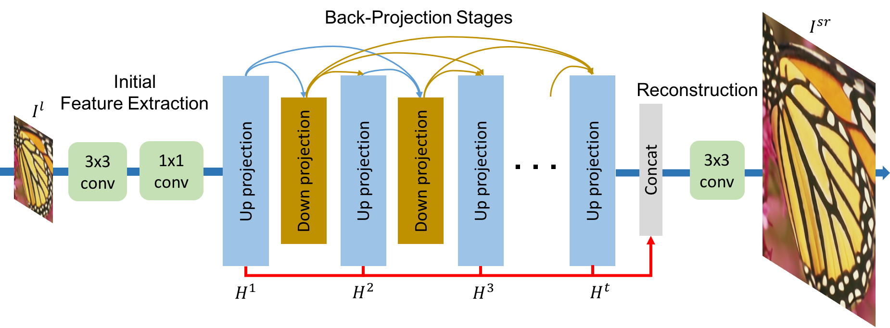
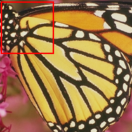
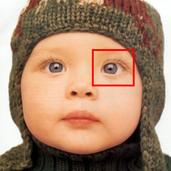
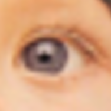
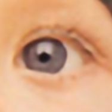
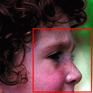

# Super-Resolution with Deep Back-Projection Networks

Repository ini merupakan implementasi dari jurnal berjudul "Deep Back-Projection Networks For Super-Resolution", dibuat untuk memenuhi tugas mata kuliah Pengenalan Pola.

## 🧠 Deep Back-Projection Networks (DBPN)



DBPN adalah model jaringan saraf tiruan yang digunakan untuk meningkatkan resolusi gambar. Model ini terdiri dari dua bagian utama, yaitu jaringan dekonvolusi dan jaringan proyeksi balik. Jaringan dekonvolusi bertugas untuk menghasilkan gambar dengan resolusi yang lebih tinggi, sedangkan jaringan proyeksi balik bertugas untuk memperbaiki gambar hasil dekonvolusi agar lebih mirip dengan gambar asli.

## 📊 Dataset

Dataset yang digunakan dalam training model yakni [DIV2K_train_HR](https://figshare.com/articles/dataset/DIV2K_train_HR_zip/9785438/1?file=17544995), yang berisi gambar dengan resolusi tinggi dan rendah. Dataset ini sering digunakan dalam penelitian super-resolusi gambar.

## 📈 Result

Berikut adalah contoh hasil pengujian menggunakan dataset [Set5](https://paperswithcode.com/dataset/set5) dengan scale x2, x4, dan x8 menggunakan [model yang sudah dilatih.](tr_model/)

| Name           | High Resolution Image                             | Input Image <br> (_Low Resolution_) | Output Image <br> (_Super Resolution_) | Scale Factor |
| -------------- | ------------------------------------------------- | ----------------------------------- | -------------------------------------- | ------------ |
| Set5_butterfly |  |       |         | <h3>x2</h3>  |
| Set5_baby      |       |       |         | <h3>x4</h3>  |
| Set5_head      |       |       |         | <h3>x8</h3>  |

## 🛠️ How to Use

### Model Training

Sebelum melakukan training model, masukkan dataset ke dalam folder `Dataset/`. Kemudian atur konfigurasi di dalam [main.py](main.py) sesuai dengan training model yang akan dilakukan, seperti jumlah epoch, batch size, dan lain-lain. Setelah itu, jalankan perintah berikut untuk melatih model.

```
python main.py
```

### Model Testing

Untuk melakukan pengujian model, masukkan gambar yang ingin ditingkatkan resolusinya ke dalam folder `Input/`. konfigurasi model yang akan digunakan di dalam [test.py](test.py). Setelah itu, jalankan perintah berikut untuk melakukan pengujian.

```
python test.py
```

## 👥 Team

-   [Adham Roy Bhafiel](https://github.com/adaamxrb)
-   [Athaya Aqilah](https://github.com/athayaaqilaa)
-   [Azila Lailannafisa](https://github.com/azilafisa)
-   [Bintang Tiara Pramesti](https://github.com/bintangtiara/)
-   [Erika Putri Lestari](https://github.com/erikaprls)
